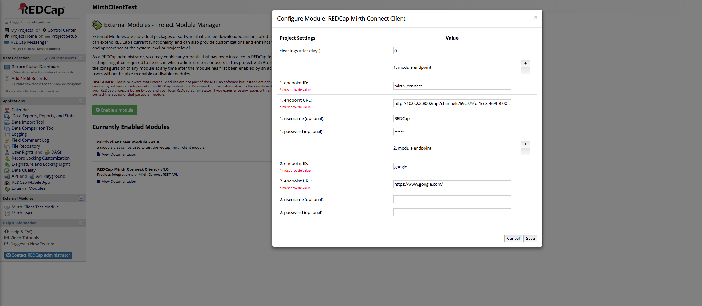
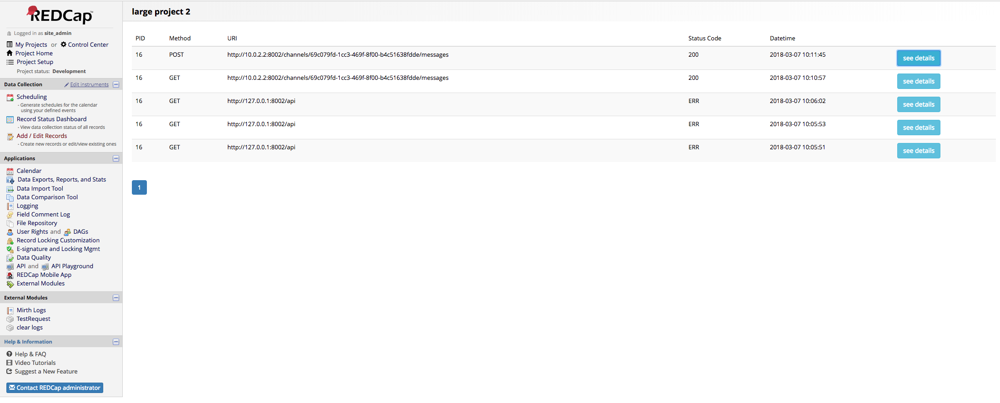
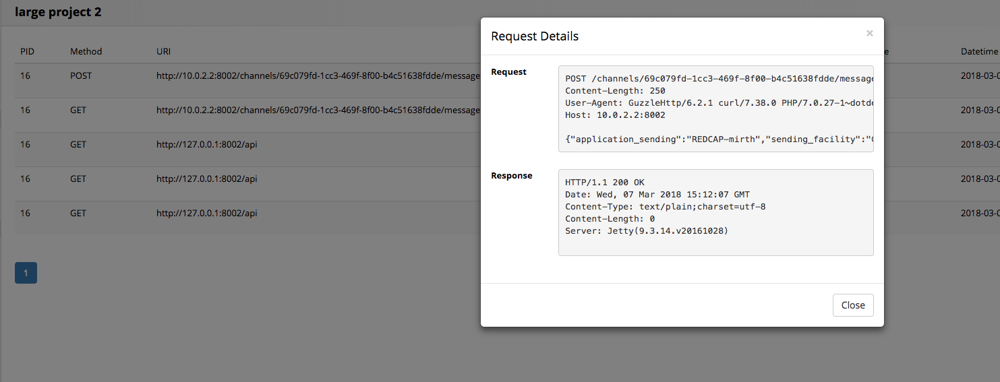

# REDCap Mirth Connect Client
This is a REDCap external module that allows other modules to communicate with the Mirth Connect REST API. It operates on the project level and logs every API request sent using it.

## Prerequisites
- [REDCap Modules](https://github.com/vanderbilt/redcap-external-modules)
- [Composer](https://getcomposer.org/)


## Installation
- Clone this repo into to `<redcap-root>/modules/redcap_mirth_client_v1.0`.
- run `composer install` inside the root of the `redcap_mirth_client_v1.0` directory get all of the dependencies.
- Go to **Control Center > Manage External Modules** and enable the REDCap Mirth Connect Client.

## Configuration
Access **Manage External Modules** page on your project. Click on the **Configure**  button associated with this module. There you can set the lifetime(in days) of the log entries this module keeps.



## How to make API calls

Here is an example of a request sending a json message to a channel.
```php
<?php
//prepare needed information
$base_url = 'http://127.0.0.1:8002/api';
$extension = '/channels/<channel id>/messages';
$json = array(
  "application_sending" => "REDCAP-mirth",
  "sending_facility" => "CTSIT",
  "receiving_application" => "Vestigo",
  "receiving_facility" => "UF",
  "time" => "201301011226",
  "message_type" => "ADT^A01",
  "message_control_id" => "HL7MSG00001",
  "process_id" => "P",
  "version_id" => "2.3"
);
$json = json_encode($json);

//create client
$client_module = \ExternalModules\ExternalModules::getModuleInstance('redcap_mirth_client', 'v1.0');
$client = $client_module->getClient($base_url);

//send JSON
$client->request('POST', $extension, $json);
?>
```

For additional sample code checkout the  [mirth_client_test_module](https://github.com/rajputd/mirth_client_test_module).

The REDCap Mirth Client module does not contain details or definitions about the Mirth Connect API services. If you need further information about the Mirth Connect API examine the documentation built into your Mirth Connect service.

### Creating a client object
This module provides the `getClient` method to generate client objects. You must pass in a base url to create the client. This base url will be used to create the end-point url that the client sends requests to.

### Available methods to make API calls
The client object provides the following methods to make API calls. Note that each method returns a response object that contains the server response.

| Method   | Description   |
|:---------|:--------------|
|request($method, $extension [,$payload]) |Sends a request using $method to the base_url of the client appended with the $extension. Optionally, a $payload can be set inside the request being sent. However, this is only valid for POST and PUT requests.|
|get($extension) |Sends a GET request to the base_url of the client appended with the $extension.|
|delete($extension) |Sends a DELETE request to the base_url of the client appended with the $extension.|
|post($extension [, $payload]) |Sends a POST request to the base_url of the client appended with the $extension. Optionally, a $payload can be set inside the request being sent.|
|put($extension [, $payload]) |Sends a PUT request to the base_url of the client appended with the $extension. Optionally, a $payload can be set inside the request being sent.|

### Parsing request responses
This module is built on top of Guzzle 6. Consequently, every client method outlined above returns a response object that implements the PSR-7 interface. For details about how to use these objects checkout the [Guzzle 6 Documentation on responses](http://docs.guzzlephp.org/en/stable/quickstart.html#using-responses).

## Logs page
You may track API calls at the project level by using the **Mirth Logs** page under the **External Modules** in the left hand project menu.




Remember that in order to avoid storage problems you can set a lifetime to each log entry on the configuration page. There is a cron job that deletes expired log entries daily.
